### Connect ESP32-S3 to Azure IoT

<div style="text-justify: inter-word; inter-character;">
This work describes a step-by-step procedure for connecting the <a href="https://www.amazon.com/FREENOVE-ESP32-S3-WROOM-Compatible-Wireless-Detailed/dp/B0BMQ8F7FN/ref=sr_1_2_sspa?keywords=esp32-s3&qid=1702168220&sr=8-2-spons&sp_csd=d2lkZ2V0TmFtZT1zcF9hdGY&psc=1" alt="Amazon Product Page"> ESP32-S3 </a>to Azure IoT Central. The setup includes the DHT11 temperature/humidity sensor to demonstrate remote data monitoring. Enabled the remote 'Run' button on IoT Central to toggle the built-in LED light on the ESP32-S3 microcontroller. Finally, added and tested a turbidity sensor to the ESP32-S3.
</div>
<br> 


Table of Contents:<br>
    A. [Create an app on Iot Central](#a-create-an-app-on-iot-central)  
    B. [Create Device](#b-create-device)    
    C. [Prepare the Actual Device](#c-prepare-the-actual-device)    
    D. [Adjust Display](#d-adjust-display)  
    E. [Enable Remote control](#e-enable-remote-control)  
    F. [Add a Turbidity Meter](#f-add-a-turbidity-meter)  

***

#### <a name="a-create-an-app-on-iot-central">A. Create an app. on Iot Central</a>

1. Create an account (only do this once) on <a href="https://azure.microsoft.com/">https://azure.microsoft.com/</a>.
2. Go to <a href="https://portal.azure.com">https://portal.azure.com</a>. Click on IoT Central Applications. Click on Create iot central application.
3. Fill out the form as follows:
   - Subscription: Free Trial.
   - Resource group: MyResourceGroup.
   - Resource name: uniqueiot123.
   - Application URL: esp32-dht11.
   - Template: Custom application.
   - Region: Central US.
   - Pricing plan: Standard 0.
   - Click on "Review + create".
   - Click "create".
   - You will see a window that says "Deployment in progress".
   - Within a minute or so, the status will change to "Your deployment is complete".
   - Click on: "Go to resource" to enter into the newly created app page called uniqueiot123.
4. On uniqueiot123 page, click on the IoT Central Application URL: https://esp32-dht11.azureiotcentral.com. 

**Note:** If you change your mind and need to delete your application, from apps.azureiotcentral.com/myapps, click on the specific application and scroll to the bottom of the side-bar > Within Settings click on Application to get into the Management page > Scroll down and click on Delete.

#### <a name="b-create-device">B. Create Device</a>

1. On the url page, you will land on the Devices page by default. Click on "Add a device". 

2. Fill out the form as follows:
   
   - Device name: esp32-dht11
   
   - Device ID: esp32-dht11
   
   - Organization: uniqueiot123 (auto-filled)
   
   - Device template: Unassigned
   
   - Click on "create" 
   
   - The newly created device name will be listed on "All devices" page (Figure A1).
     
     
     
     <b>Figure B1. All devices table.</b>"
   
   - Click on "esp32-dht11"
   
   - Click on "Connect" to display the ID Scope, Device ID, and Primary Key.
     
     
     
     <b>Figure B2. esp32-dht11 page.</b>
     
     - Since the device has not been connected, when you click on esp32-dht11, you will see a blank table as in Figure B3 below.
     
     
     
     <b>Figure B3. Unpopulated esp32-dht11 table.</b>

#### <a name="c-prepare-the-actual-device>C. Prepare the Actual Device</a>

1. Connect DHT11to ESP32-S3 as shown in the picture below. The connections are as follows:
   
   - Signal (Left): Pin No. 4 (Yellow) 
   
   - Vcc (middle): 3.3V (Red)
   
   - Ground (right): GND (Black)
     
     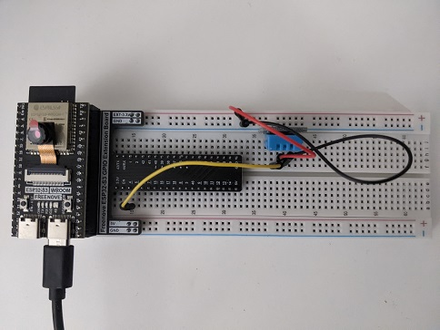 
     
     <b>Figure C1. DHT11 connection to ESP32-S3 (top view)</b>
     
     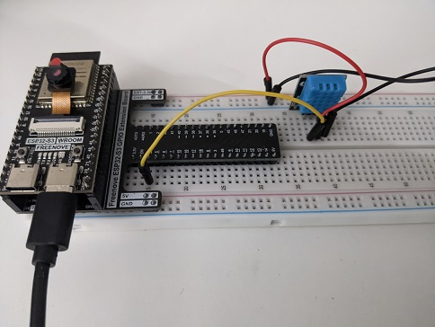
     
     <b>Figure C2. DHT11 connection to ESP32-S3 (side view)</b>

2. Set up Arduino IDE
   
   - To communicate ESP32-S3 to an Arduino IDE, follow the instructions described in the manufacturer's manual (Freenove_Basic_Starter_Kit_for_ESP32_S3-main\C\C_Tutorial.pdf), which can be downloaded from <a href="https://freenove.com/tutorial">FNK0084 - Freenove Basic Starter Kit for ESP32-S3</a>
   
   - After configuring Arduino IDE environment according to the instructions described in the manual, set the board to ESP32S3 Dev Module. Access this option by going to Tools > Board: "ESP232S3 Dev Module" > ESP32S3 Dev Module. Also, select the appropriate communication port by going to Tools > Port: COMx. x is the port number (e.g., COM3). You only need do set the board and communication port once.  

3. Test DHT11 (Optional)
   
   - On Arduino IDE, go to File > New. Copy and paste the code below. The code will require the following dependencies to be installed. To install the dependencies on Arduino IDE, go to Sketch > Include library > Manage libraries...
     
     - DHT sensor library
     - Adafruit Unified Sensor
   
   - You only need to install these dependencies once.
   
   - If you wish to delete any of the installed libraries, navigate into *C:\Users\yourusername\Documents\Arduino\libraries* and manually delete the library folder. 
   
   - Go to Sketch > Verify/Compile. Read the error message to reveal any issues.
     
     ```
     //source: https://www.electronicshub.org/esp32-dht11-tutorial/
     //https://randomnerdtutorials.com/esp32-dht11-dht22-temperature-humidity-sensor-arduino-ide/
     //https://www.arduino.cc/reference/en/libraries/dht-sensor-library/
     
     #include "DHT.h"
     #define DHT11PIN 4
     
     DHT dht(DHT11PIN, DHT11);
     void setup()
     {
     
     Serial.begin(115200);
     /* Start the DHT11 Sensor */
     dht.begin();
     }
     
     void loop()
     {
     float humi = dht.readHumidity();
     float temp = dht.readTemperature();
     Serial.print("Temperature: ");
     Serial.print(temp);
     Serial.print("ºC ");
     Serial.print("Humidity: ");
     Serial.println(humi);
     delay(1000);
     }
     ```
   
   - To view the humidity and temperature output from DHT11 sensor, go to Tools > Serial Monitor. The following window will pop out. Make sure to match the baud rate with the number you specify in the code. In this case, the baud rate is 115200.
     
     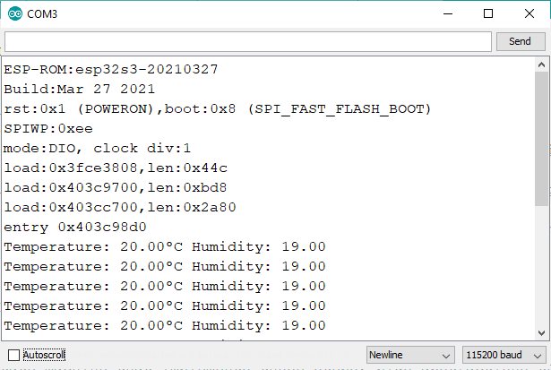
     <b> Figure C3. Humidity and temperature. </b>

4. Check wi-fi connection (Optional)
   
   - Upload the code below that is provided in the Freenove ESP32-S3 package, and check to make sure that you can be connected to the wi-fi network.
     
     ```
     #include <WiFi.h>
     
     const char* ssid = "yourNetworkName";
     const char* pass = "yourNetworkPassword";
     
     void setup() {
     Serial.begin(115200);
     Serial.println("Configure access piont");
     WiFi.softAP(ssid, pass);
     IPAddress myIP = WiFi.softAPIP();
     Serial.print("AP-IP Address");
     Serial.println(myIP);
     }
     
     void loop() {
     }
     ```
     
     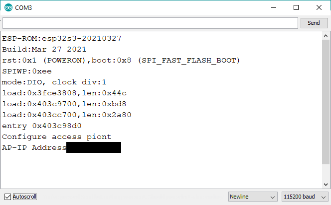
     <b>Figure C4. Serial monitor.</b>

5. Connect Device to IoT Central via a Simulation Code
   5.1. Enable mobile hotspot to broadcast 2.4 GHz wifi network
   
   - Enable a mobile hotspot and set the Network band to 2.4 GHz (not 5 GHz). Note the Network name (SSID) and password amd turn the mobile hotspot on. 
     
     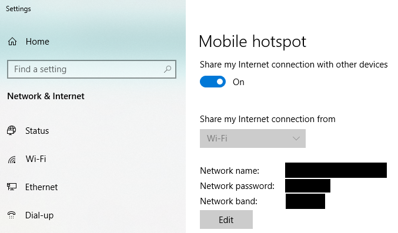
     <b>Figure C5. Mobile hotspot configuration.</b>
   
   5.2. Upload script into ESP32-S3 microcontroller
   
   - Use the example code to connect the ESP32-S3 to Azure IoT central. You must first install the library by going to Sketch > Include Library > Manage Libraries ... and search and install Azure SDK for C.
   
   - Once the library is installed, go to File > Examples > Azure SDK for C > Azure_IoT_Central_ESP32 to load the example script. 
   
   - Save the script as ESP32_AzureIoT_Simple/ESP32_AzureIoT_Simple.ino. The rest of the depent files will be saved along with it automatically.
   
   - Below shows the contents of the *iot_configs.h* file that requires modification. See section B to retrieve the relevant parameters.
     
     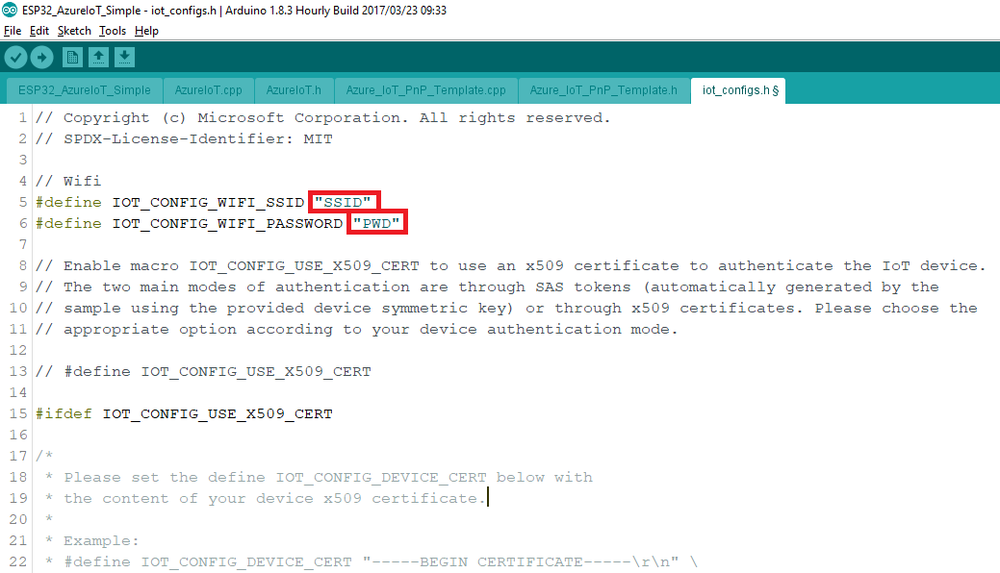
     <b> Figure C6a. The 2.4 GHz wifi that requires modification for SSID (network name) and password. </b>
     
     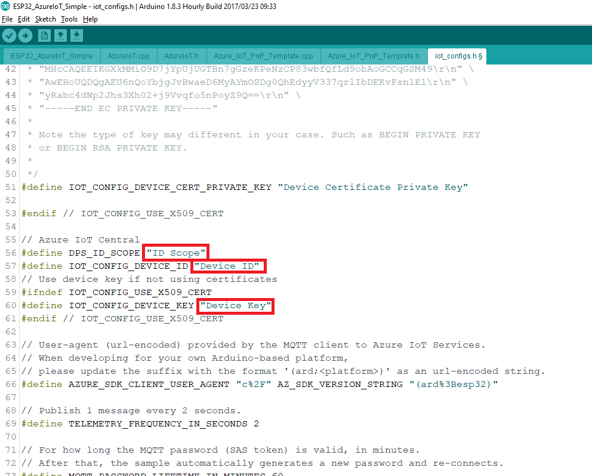
     <b> Figure C6b. The IoT Central parameters that require modifications for ID_SCOPE, DEVICE_ID, and DEVICE_KEY. </b>
   
   - Click on Sketch > Upload to load the script into the ESP32 microcontroller.
   
   - Once the upload is complete, go to Tools >  Serial Monitor.
     
     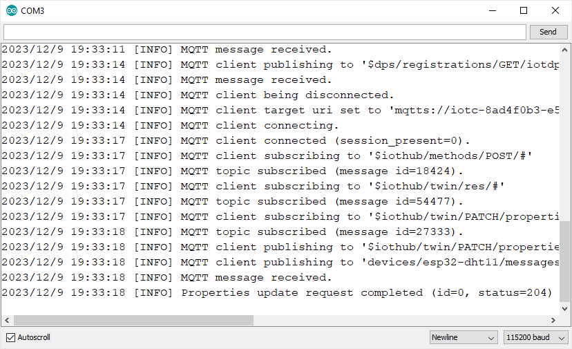
     
     <b>Figure C7. Serial monitor showing the connection status.</b>
   
   - Below shows the status of the device on IoT Central.
     
     
     
     <b> Figure C8. Updated table.</b>
   
   - The table is now updated. The Device status automatically changes to Provisioned. A _default template_ is assigned automatically because the Azure Iot Central has a Plug and Play feature that simplifies the setup process by retrieving a device's telemetry, commands, and properties based on its ID. 
   
   - Click on esp32-dht11 to view the sensor parameters.The Overview tab is automatically selected to display the charts. If not, click on it.
     
     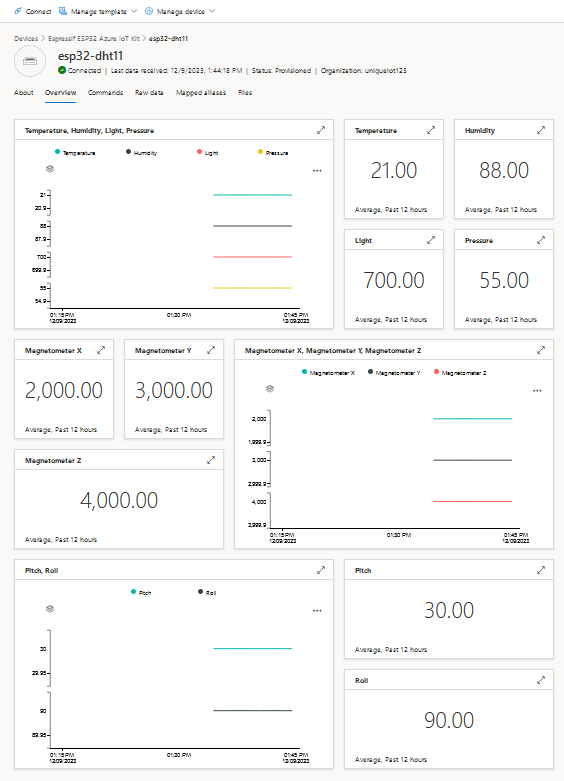
     
     <b> Figure C9. esp32-dht11 Overview. </b>

6. Activate DHT11 and display temperature and humidity data on IoT Central [4]
   
   - In the iot_configs.h file, add the boxed script to acivate dht11.
   
   - In the ESP32_AzureIoT_Simple file, add the boxed script to activate dht11.
   
   - Follow the instructions in section 5 above to MODIFY the essential parameters in the iot_configs.h file (i.e., IOT_CONFIG_WIFI_SSID, IOT_CONFIG_WIFI_PASSWORD, DPS_ID_SCOPE, IOT_CONFIG_DEVICE_ID, and IOT_CONFIG_DEVICE_KEY) to suit your settings. I recommend copying and pasting these parameters rather than transcribing because the device may not function properly due to typo.
   
   - SET the DHT_PIN to 4 within the iot_config.h file (see Figure C10).
     
     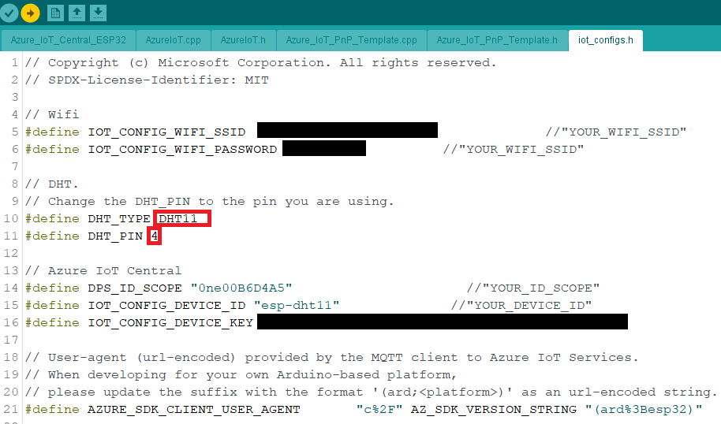
     
     <b> Figure C10. Change DHT_PIN to 4 in iot_configs.h. </b>
   
   - Upload the script into the ESP32-S3 microcontroller.
   
   - Once uploaded, it takes about a minute to be connected. You can also watch the status of the communication from the serial monitor window. Once connected, you will see that the temperature and humidity values change to a different value that the default values. You can blow hot air with a hair dryer or a heater fan to alter the temperature and humidity (See Figure C11). 
     
     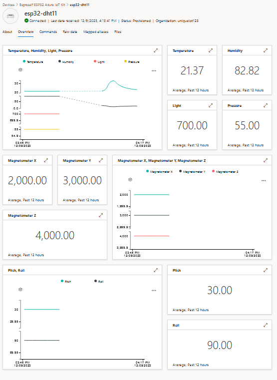
     
     <b> Figure C11. esp32-dht11 Overview. </b>

#### <a name="d-adjust-display">D. Adjust Display</a>

1. Delete irrelevant subwindows
   
   - Since only the humidity/temperature sensor is installed, we are only interested to see these two parameters on the graph and on the subwindows.
   
   - To display only the parameters that are of interests, click on "Device templates" on the side bar and click on Espressif ESP32 Azure IoT Kit.
   
   - On the Espressif ESP32 Azure IoT Kit page, click on Version. Call it "Espressif ESP32 Azure IoT Kit v2" and click create.
   
   - If you click again on Device templates, you will see the new version being displayed in the table. Click again on Espressif ESP32 Azure IoT Kit v2.
   
   - Click on Overview.
   
   - On each of the subwindows other than Temperature and Humidity, either click on "X" or click on "...", followed by "Delete". Click and drag on "Humidity" window to rearrange. Also, click on the edit (pencil logo) button on the main graphing window and edit the plot title to just Temperature and Humidity and click Update. Below is the new layout.
   
   - Click Save.
     
     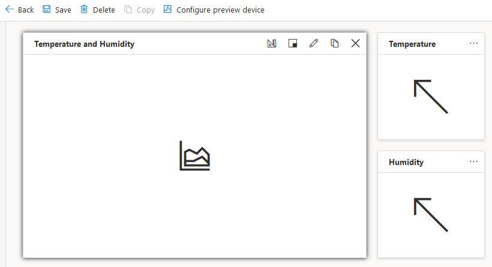
     
     <b> Figure D1. The new Device template. </b>
   
   - Click on the back arrow to return to the Espressif ESP32 Azure IoT Kit v2 page. 
   
   - Click on Publish > Click on Publish again when a window pops out.  

2. Assign device to the new template
   
   - Click on Devices on the side bar.
   
   - Click on esp32-dht11.
   
   - Click on Manage Template > Assign template > Select Espressif ESP32 Azure IoT Kit v2 and click assign template.
   
   - You will be led to the About page. Click on Overview to see the new display which only show the relevant parameters.
     
     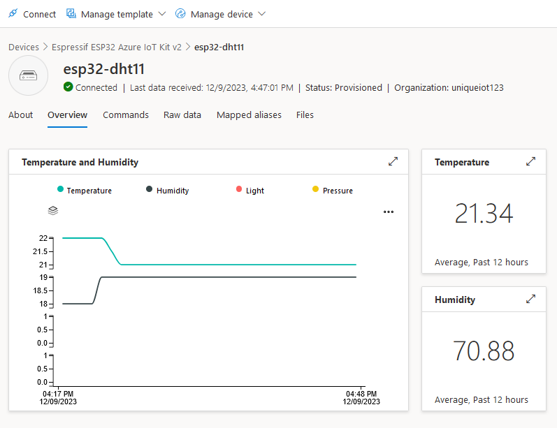
     
     <b> Figure D2. esp32-dht11 data displayed on the new Device template. </b>

#### <a name="e-enable-remote-control">E. Enable Remote control</a>

1. As a demonstration, we can enable the "Run" button of the Iot Central interface to toggle the builtin led on and off (LED 2). Modify the Arduino  script as follows:
   
  - Within the Azure_IoT_Central_ESP32 tab, add the line: #define LED_BUILTIN 2 (Figure E1).
     
     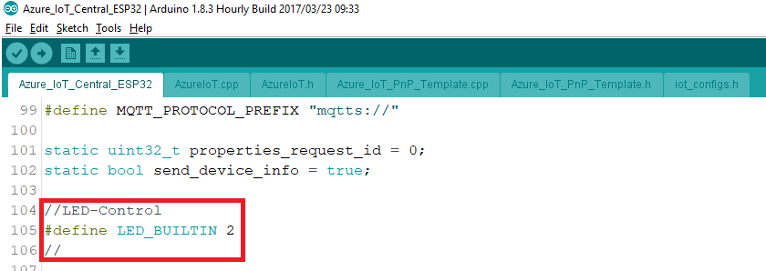
     
     <b> Figure E1. The Azure_IoT_Central_ESP32 tab first modification. </b>
     
  - Add another line within the void loop() functioon (Figure E2).
     
     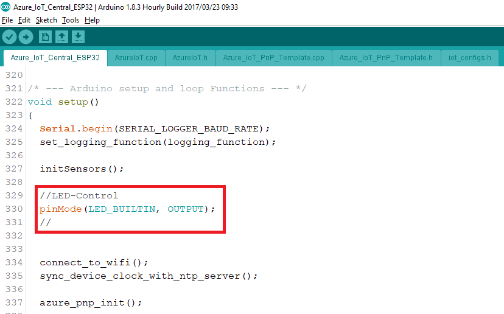
     
     <b> Figure D4. The Azure_IoT_Central_ESP32 tab second modification. </b>
     
  - Within the Azure_IoT_PnP_Template.cpp tab, add the line: digitalWrite(LED_BUILTIN, led1_on);. 
     
     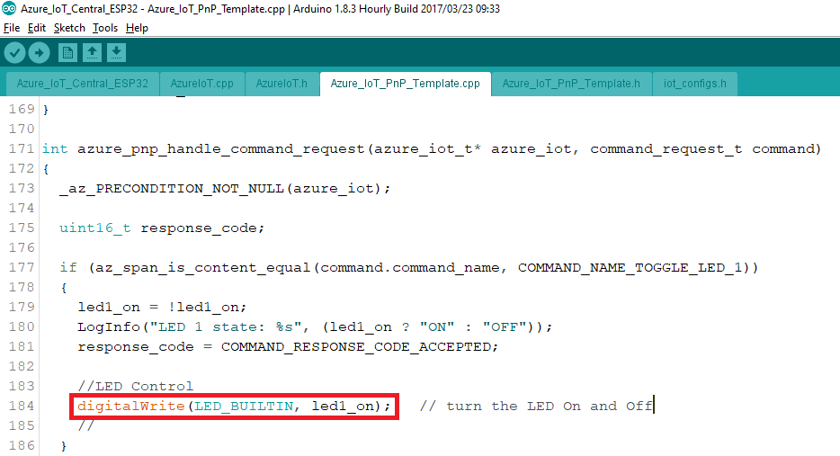
     
     <b> Figure E3. The Azure_IoT_PnP_Template.cpp tab third modification. </b>
     
  - After making the modifications to the script, re-upload the script into the ESP32 microcontroller.

2. Test the button.
   
   - To test the button, on the esp32-dht11 Devices page, click on the Commands tab.
   
   - Toggle the "Run" button to turn the builtin LED light on and off (Figure E4). 
     
     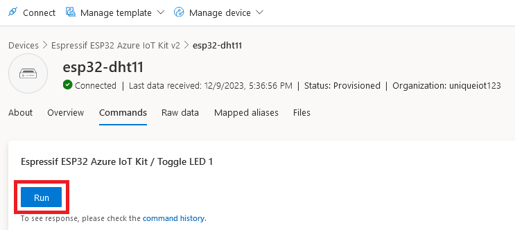
     
     <b> Figure E4. The Azure_IoT_PnP_Template.cpp tab third modification. </b> 
   
   - Figure E5a and E5b show the builtin LED button in the on and off states, respectively.
     
     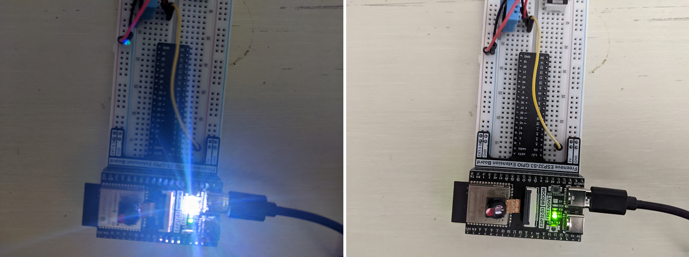
     
     <b> Figure E5. The builtin LED light in the (Left) "ON" and (Right) "OFF" states. </b> 

#### F. <a name="f-add-a-turbidity-meter">Add a Turbidity Meter</a>

1. Installing the <a href="https://www.amazon.com/Turbidity-Quality-Monitoring-Detection-TSW-20M/dp/B07MVRQXFW/ref=asc_df_B07MVRQXFW/?tag=hyprod-20&linkCode=df0&hvadid=507909480377&hvpos=&hvnetw=g&hvrand=6932766439968375556&hvpone=&hvptwo=&hvqmt=&hvdev=c&hvdvcmdl=&hvlocint=&hvlocphy=9021681&hvtargid=pla-1346641968627&psc=1&mcid=27f231f67750332ebcb2015b543cb9c4&gclid=EAIaIQobChMI4-TSr56GgwMVJjStBh1noAo8EAQYAyABEgLjxPD_BwE"> turbidity sensor </a> to ESP32-S3.

  -Figure F1 below shows how the turbidity meter is attached to the ESP32-S3 microcontroller, which are as follows.
    - G (Ground): GND (Black)

    - V (Voltge): 5 V (Red)
    
    - S (Signal): Pin No. 1 (Yellow)

   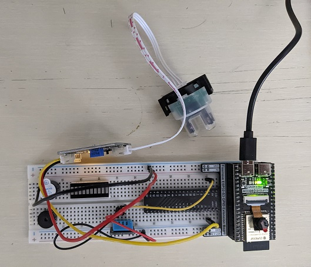

   <b>Figure F1. Turbidity meter.</b>

2. The Arduino script is as follows (adapted from Freenove's example codes, Sketch_08.1_ADC):

    ```
    #define PIN_ANALOG_IN  1
    void setup() {
      Serial.begin(115200);
    }

    void loop() {
      int adcVal = analogRead(PIN_ANALOG_IN);
      double voltage = adcVal * (5.0 / 1024.0);
      Serial.printf("Sensor Output (V): %d, \t Voltage: %.2fV\r\n", adcVal, voltage);
      delay(200);
    }
    ```
3. Operation demonstration.
  - Once uploaded into the microcontroller, on Arduino IDE, go to Tools > Serial plotter to view the plot of signal versus time (Figure F2). As a test, I blocked the turbidity meter first with a piece of A4 white paper that caused the signal to dip close to zero. Second, I blocked the signal with a plastic ruler that caused the signal to dip only slightly.

  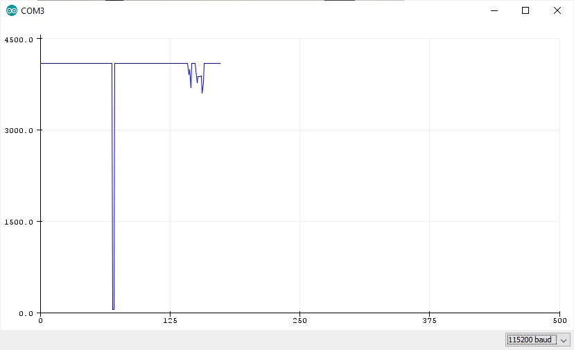

  <b> Figure F2. Serial plotter. </b>


#### <a name="reference">Reference</a>

1. Freenove, "Freenove", url: https://freenove.com/tutorial (Accessed on: Dec 12, 2023)
2. Microsoft IoT Developers, "Demo: Arduino library for Azure IoT deep dive", url: https://www.youtube.com/watch?v=MLsnNXhzc2k (Feb 1, 2022)
3. RLeclair. "Getting started with the ESPRESSIF ESP32 and Azure IoT Central with Azure SDK for C Arduino library", url: https://github.com/Azure/azure-sdk-for-c-arduino/tree/main/examples/Azure_IoT_Central_ESP32 (July 2023)
4. momuno, "
   azure-iot-central-esp32-sample ", url: https://github.com/microsoft/azure-iot-central-esp32-sample (Dec 13, 2022)

***
